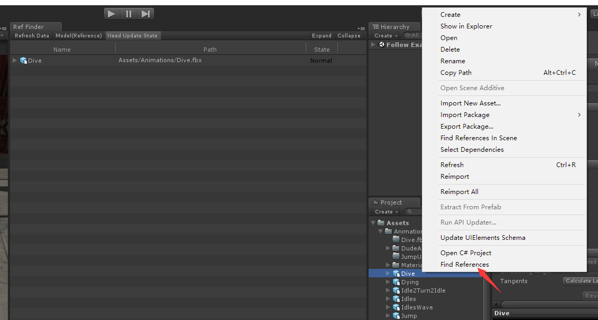
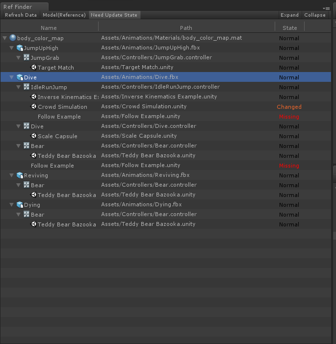

# Unity 引用查找

## 简介

&emsp;&emsp;这是一个用来查找资源引用和依赖的插件，通过缓存来保存资源间的引用信息，通过树状结构直观的展示。  
&emsp;&emsp;由于是通过缓存进行实现的，所以在希望的到精确的引用信息时需要刷新缓存。不过由于缓存的存在，在资源改动较少的情况下，刷新速度较快，对使用影响较小。  
&emsp;&emsp;直接将文件夹拖到项目中即可使用。  

## 环境

- Unity 2018.4.0f1
- Unity 2017.4.35f1
- Unity 5.6.6f2

## 使用示例

&emsp;&emsp;右键需要查找引用的文件或文件夹，点击 `Find References In Project` 进行查找。  
  
**按钮含义：**  
Refresh Data:刷新缓存
Model:切换引用和依赖
NeedUpdateState:是否需要根据当前文件的状态更新State栏。  
Expand:展开列表
Collapse:折叠列表
  
  
&emsp;&emsp;第三列的State为Changed代表这个资源被修改了，Missing代表资源被删除了，No Data代表缓存中没有该资源的信息。  

## 实现方案

### 方案选择

&emsp;&emsp;1.在每次需要查找时进行一次全局查找，保证查找的正确性。但是进行全局查找会很慢，因为查找资源依赖信息的接口GetDependencies本质上其实是对文本的查找(比如prefab中会以文本的形式记录prefab所引用资源的guiid和fileid)，在不进行多线程查询优化的情况下这是一个很慢的过程，存储在机械硬盘上时会更慢。  
&emsp;&emsp;2.进行一次全局查找生成缓存，在进行查找时直接读取缓存（在资源改动时会出现引用信息不准确的问题），在资源变动时需要更新缓存，保持查找的正确性，不过由于缓存的存在，在资源没有太大的改动的情况下，刷新速度较快。

&emsp;&emsp;这里选择了方案二。

### 查找及缓存

**引用信息的生成:**  
&emsp;&emsp;通过AssetDatabase.GetAllAssetPaths()获取项目中所有的资源路径。  
&emsp;&emsp;通过AssetDatabase.GetDependencies()获取每一个资源所依赖资源的信息。  
&emsp;&emsp;经过这两步之后就有了所有资源的依赖信息了。  
&emsp;&emsp;通过资源的依赖信息，我们就可以生成所有资源的引用信息了。  
**缓存:**  
&emsp;&emsp;为了让缓存尽量的小，所以缓存只保存每个资源的guid、引用资源哈希值、依赖资源的信息。
&emsp;&emsp;其中引用资源哈希值时用于判断这个资源依赖的资源是否有修改，若有修改，则在刷新资源引用信息的时候需要重新读取这个资源的依赖信息，否则继续使用该信息。这个判断就是在资源改动较少时减少刷新时间的关键。  
&emsp;&emsp;在记录依赖时，没有直接记录依赖资源的guid，而是记录了资源在缓存中下标的位置，从而进一步缩小缓存的大小。  

### 界面实现

&emsp;&emsp;主要使用了Unity自带的TreeView实现树形界面的展示。  
